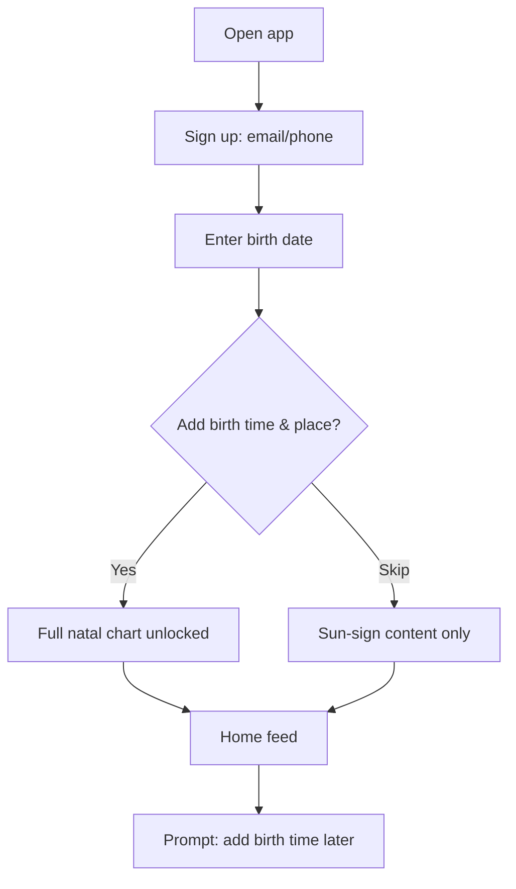
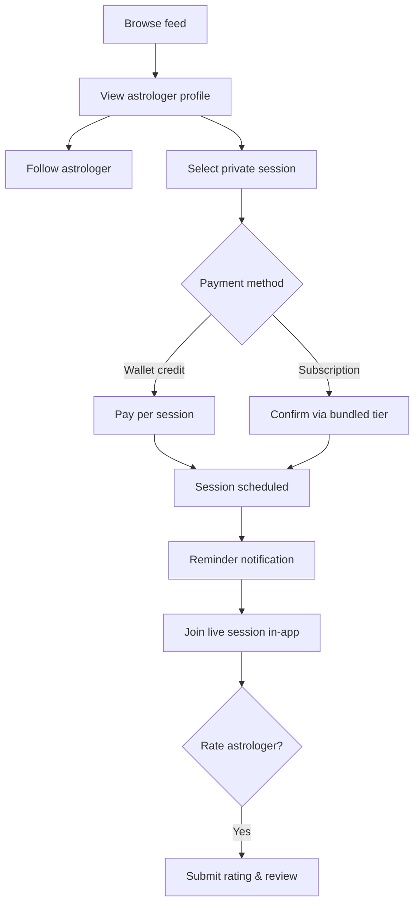
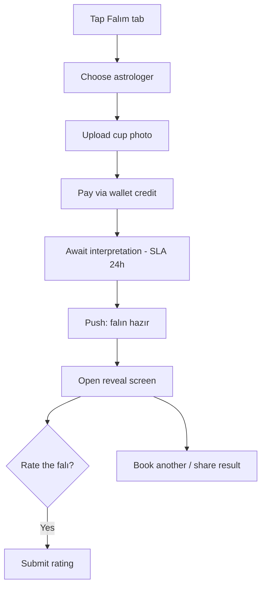
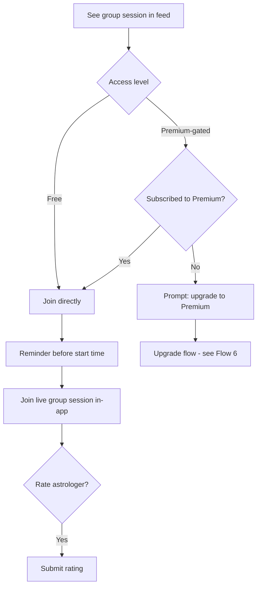
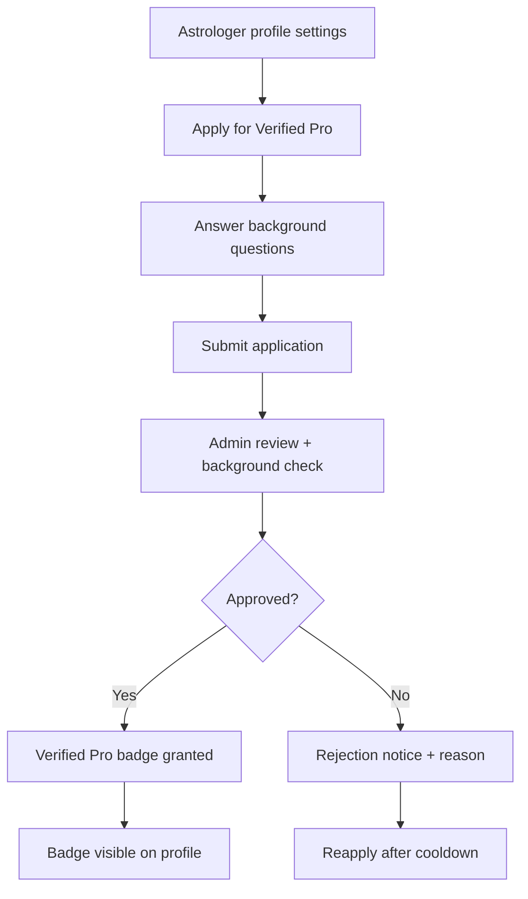
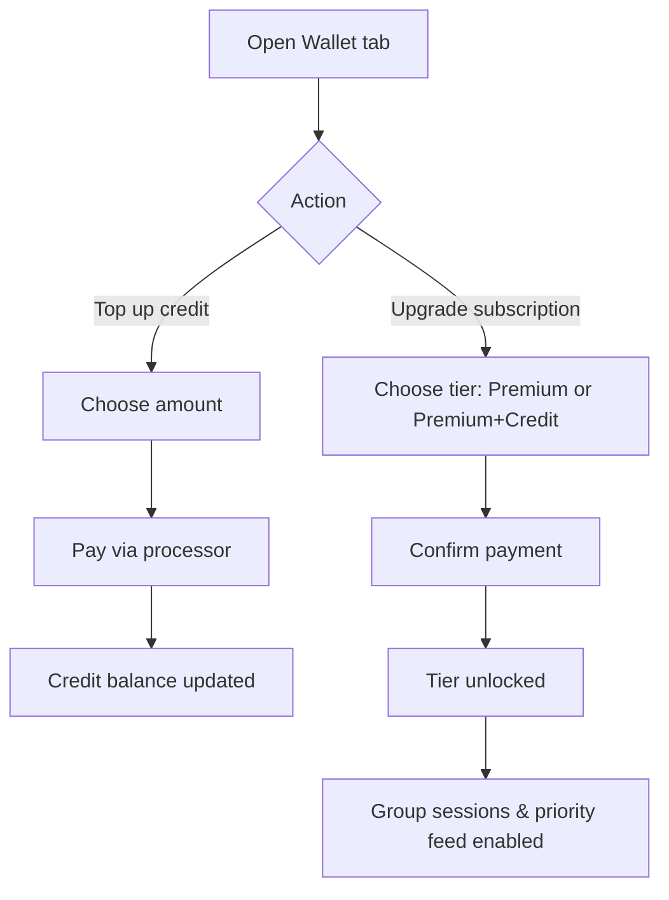
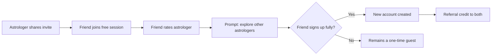

# Sirea — User Flow Diagrams

2026-09-21 · @Someone

Companion to the Sirea PRD — step-by-step flows for the core journeys named there. Built on the same English/international-scope assumption flagged in the PRD; revisit if that assumption changes.

## 1. Onboarding

Birth time/place capture is optional at signup (skip leads straight to sun-sign content); a later in-feed prompt invites users to complete their chart once they've engaged with content.

## 2. Discovery to Private Session Booking

Following and booking are independent actions off the same profile screen — a user can book without following, though following is what surfaces the astrologer in the home feed's stories row going forward.

## 3. Kahve Falı

Async photo-upload is the default path shown here; the live video/voice variant reuses the same in-app session infrastructure as private astrology sessions (Flow 2) rather than a separate flow.

## 4. Group Session

A user blocked by a premium-gated session is routed into the subscription-upgrade flow (Flow 6) rather than a dead end, keeping the paywall itself as a conversion moment.

## 5. Verified Pro Badge Application

Review is case-by-case (per the PRD), so "admin review" here stands in for a manual workflow, not an automated checklist; the Trust & Safety document is the place to define the review criteria in detail.

Separately, the platform-initiated path (hand-selected, already-known astrologers granted the badge directly) bypasses this flow entirely and is not diagrammed — it is a manual, invite-only action taken by platform/growth ops, not a user-facing flow.

## 6. Wallet Top-Up & Subscription Upgrade

Both paths are reachable from the same Wallet screen; a top-up never requires a subscription and a subscription upgrade never requires a wallet top-up, per the PRD's note that the two are orthogonal (Section 9).

## 7. Referral / Invite Loop

The conversion prompt at step D (surfacing other content immediately after the friend rates) is the deliberate design choice discussed earlier — turning an incidental visitor into an explored one before they leave, rather than treating the free-session-for-ratings pattern as something to restrict.
